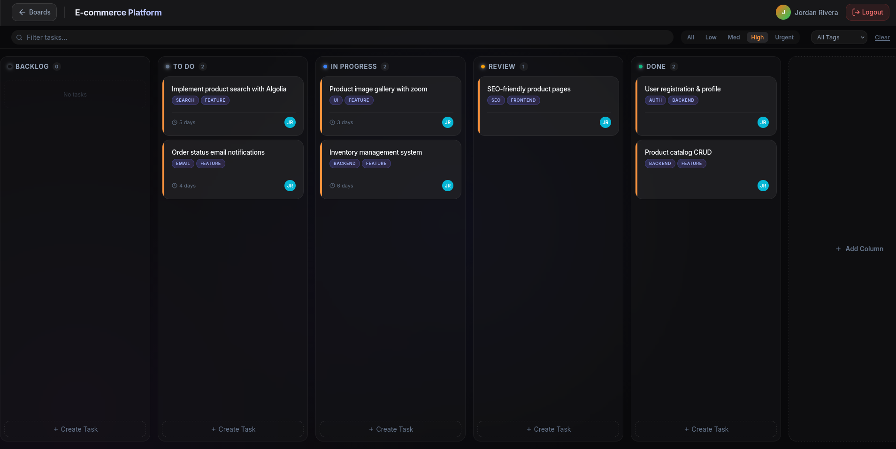

<p align="center">
  
</p>

<h1 align="center">SolidBoard — High-Performance Kanban Task Manager</h1>

<p align="center">
  <strong>A production-grade, Jira-style Kanban board built with SolidJS & Express</strong><br>
  <em>Showcasing fine-grained reactivity, custom drag-and-drop, real-time filtering, and modern glassmorphic design</em>
</p>

<p align="center">
  
  
  
  
  
</p>

---

## Why This Project?

This project demonstrates **Full-Stack Proficiency** and **Advanced Frontend Engineering** skills:

1.  **High-Performance Architecture**: Leveraged **SolidJS** for O(1) fine-grained updates, eliminating the Virtual DOM overhead common in React apps.
2.  **Complex State Management**: Implemented deep reactivity using Solid Stores (`createStore`) to handle nested board-column-task relationships seamlessly.
3.  **Custom Interactive UI**: Built a performant **Drag-and-Drop** system from scratch using the native HTML5 Drag API (no heavy libraries like `react-beautiful-dnd`).
4.  **Optimistic UI Updates**: Instant user feedback for actions like task movement and creation, syncing with the backend in the background.
5.  **Robust Backend Design**: RESTful API with **Express/Mongoose** featuring relational data modeling, aggregation pipelines, and secure **JWT Authentication**.

---

## Functionality Showcase

### **1. comprehensive Workspace Management**
Manage multiple projects with a clean, grid-based dashboard. Each board tracks task counts and custom tags.


### **2. Powerful Filtering & Search**
Instantly find tasks across columns using real-time search, priority filters, and tag selection.


### **3. Rich Task Details**
Full-featured task editor with support for multi-color labels, due dates, priorities, and rich text descriptions.



---

## Key Features

### **Smart Task Management**
| Feature | Description |
| :--- | :--- |
| **Drag & Drop** | Smooth, accessible drag operations for tasks and columns |
| **Inline Editing** | Rename boards and tasks instantly without heavy modals |
| **Smart Filtering** | Real-time filtering by text, priority, and tags |
| **Dynamic Tags** | Auto-creating tag system — type to create, click to reuse |
| **Due Date Tracking** | Visual indicators for upcoming and overdue deadlines |

### **Premium UI/UX Design**
- **Glassmorphism**: Modern frosted glass aesthetic with backdrop blur.
- **Micro-animations**: Smooth transitions for hover states, modals, and drag operations.
- **Responsive**: Fully optimized for Desktop, Tablet, and Mobile.
- **Dark Mode**: Eye-friendly dark theme by default.

---

## Tech Stack Details

| Layer | Technology | Role |
| :--- | :--- | :--- |
| **Frontend** | **SolidJS** | Reactive UI framework (No VDOM) |
| **State** | **Solid Stores** | deeply nested reactive state |
| **Routing** | **@solidjs/router** | Client-side navigation |
| **Build** | **Vite** | Next-gen bundler (HMR) |
| **Backend** | **Express.js** | Scalable REST API |
| **Database** | **MongoDB** | Flexible document storage |
| **Auth** | **JWT + bcrypt** | Stateless, secure authentication |

---

## Rapid Setup

```bash
# 1. Clone the repository
git clone https://github.com/Mohammed6903/solidboard.git

# 2. Install Dependencies (Root handles both)
cd solidboard
npm install && npm run install-all

# 3. Configure Environment
cp frontend/.env.example frontend/.env
cp server/.env.example server/.env

# 4. Start Development (Concurrent Frontend + Backend)
npm run dev
```

---

## Project Structure

```
solidboard/
├── frontend/
│   ├── src/
│   │   ├── components/    # Reusable UI (TaskCard, Modal, etc.)
│   │   ├── pages/         # Route Views (BoardPage, Landing)
│   │   ├── store/         # Global Reactive Stores
│   │   ├── styles/        # CSS Modules & Variables
│   │   └── utils/         # API & Helper functions
│   └── public/            # Static Assets
│
└── server/
    ├── models/            # Mongoose Schemas (User, Board, Task)
    ├── routes/            # API Endpoints
    └── controllers/       # Business Logic
```

---

## License
MIT License © 2026 Mohammed Usmani

<p align="center">
  <strong>Built with ❤️ using SolidJS</strong><br>
  <em>Open to opportunities! Let's connect.</em>
</p>
