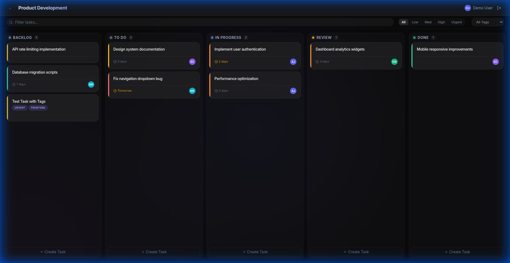
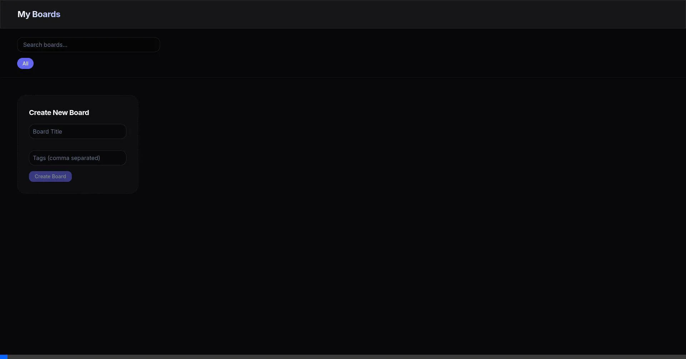
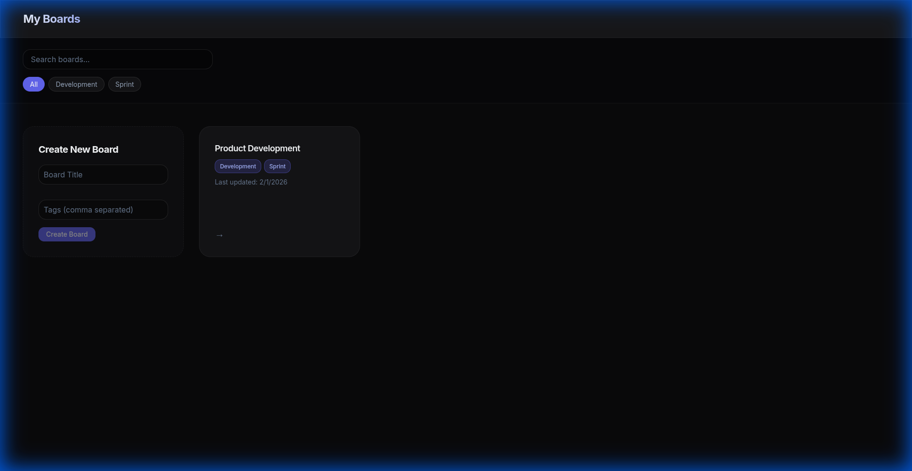

<p align="center">
  
</p>

<h1 align="center">SolidBoard - Modern Kanban Task Manager</h1>

<p align="center">
  <strong>A production-grade Jira-style Kanban board built with SolidJS</strong><br>
  <em>Showcasing reactive UI, custom drag-and-drop, real-time filtering, and modern design</em>
</p>

<p align="center">
  
  
  
  
</p>

---

## Live Demo



---

## Key Features

## **Smart Task Management**

| Feature               | Description                                                                     |
| --------------------- | ------------------------------------------------------------------------------- |
| **Drag & Drop**       | Custom implementation without external libraries—smooth, performant, accessible |
| **Smart Filtering**   | Real-time search with priority and custom tag filtering                         |
| **Dynamic Tags**      | Auto-creating tagging system—type a new tag, it's instantly saved for reuse     |
| **Rich Task Details** | Priority levels, due dates, assignees, comments, and custom tags                |

## **Premium UI/UX Design**

- **Glassmorphism** - Frosted glass effects with backdrop blur
- **Gradient Accents** - Vibrant purple/indigo color palette
- **Micro-animations** - Smooth hover states and transitions
- **Dark Theme** - Eye-friendly interface for extended use
- **Responsive** - Seamless experience from desktop to mobile

## **Accessibility First**

- Full keyboard navigation support
- ARIA labels and live regions
- Screen reader optimized
- Focus management for modals

---

## Screenshots

<table>
  <tr>
    <td width="50%">
      
      <p align="center"><strong>Boards Dashboard</strong></p>
    </td>
    <td width="50%">
      
      <p align="center"><strong>Kanban Board View</strong></p>
    </td>
  </tr>
</table>

---

## Technical Highlights

## Why SolidJS?\*\*

SolidJS was chosen for its fine-grained reactivity and exceptional performance. Unlike virtual DOM frameworks, SolidJS compiles to direct DOM updates—resulting in minimal overhead and blazing-fast rendering perfect for interactive applications like Kanban boards.

### **Custom Drag & Drop**

Built a complete drag-and-drop system from scratch using native HTML5 Drag API:

- No external dependencies (no dnd-kit, react-beautiful-dnd)
- Keyboard-accessible drag operations
- Visual feedback during drag states
- Cross-column task movement with order preservation

### **Smart Tag System**

Innovative auto-creating tag system that improves UX:

```
User types "urgent" → System auto-creates and persists the tag
Next task creation → "urgent" appears in suggestions dropdown
```

### **Architecture**

```
├── Components          Fine-grained reactive components
├── Store               Centralized state with SolidJS signals
├── Utils               Custom hooks and helpers
│   ├── dragAndDrop     Custom drag state management
│   ├── api             Mock API with localStorage persistence
│   └── accessibility   Screen reader announcements
└── Styles              CSS design system with variables
```

---

## Quick Start

```bash
# Clone the repository
git clone https://github.com/Mohammed6903/solidboard.git

# Install dependencies
cd solidboard/frontend
npm install

# Start development server
npm run dev

# Open in browser
open http://localhost:5173
```

---

## Feature Checklist

| Category   | Feature                                   | Status |
| ---------- | ----------------------------------------- | ------ |
| **Board**  | Multiple boards support                   | ✅     |
| **Board**  | Create, edit, delete boards               | ✅     |
| **Tasks**  | Drag & drop between columns               | ✅     |
| **Tasks**  | Priority levels (Low → Urgent)            | ✅     |
| **Tasks**  | Due date tracking with overdue indicators | ✅     |
| **Tasks**  | Custom tags with auto-creation            | ✅     |
| **Tasks**  | User assignment with avatars              | ✅     |
| **Tasks**  | Comments system                           | ✅     |
| **Filter** | Real-time text search                     | ✅     |
| **Filter** | Priority filtering                        | ✅     |
| **Filter** | Tag-based filtering                       | ✅     |
| **UI**     | Glassmorphism design                      | ✅     |
| **UI**     | Responsive layout                         | ✅     |
| **UI**     | Dark theme                                | ✅     |
| **A11y**   | Keyboard navigation                       | ✅     |
| **A11y**   | Screen reader support                     | ✅     |

---

## Tech Stack

| Layer        | Technology      | Purpose                   |
| ------------ | --------------- | ------------------------- |
| **Frontend** | SolidJS         | Reactive UI framework     |
| **Routing**  | @solidjs/router | Client-side navigation    |
| **Build**    | Vite            | Fast dev server & bundler |
| **Styling**  | CSS Variables   | Design token system       |
| **Backend**  | Express.js      | REST API server           |
| **Database** | MongoDB         | Document storage          |
| **Auth**     | JWT + bcrypt    | Secure authentication     |

---

## Project Structure

```
solidJS/
├── frontend/
│   ├── src/
│   │   ├── components/
│   │   │   ├── common/        # Button, Avatar, Input, Modal
│   │   │   ├── TaskCard/      # Draggable task card
│   │   │   └── TaskModal/     # Task detail view
│   │   ├── pages/
│   │   │   ├── Landing.jsx    # Marketing page
│   │   │   ├── BoardsListPage # Board dashboard
│   │   │   └── BoardPage.jsx  # Kanban view
│   │   ├── store/             # SolidJS signals
│   │   ├── styles/            # CSS design system
│   │   └── utils/             # Helpers & API
│   └── screenshots/           # README assets
│
└── server/                    # Express API (optional)
    ├── models/                # Mongoose schemas
    ├── routes/                # API endpoints
    └── middleware/            # Auth middleware
```

---

## Keyboard Shortcuts

| Key               | Action                         |
| ----------------- | ------------------------------ |
| `Tab`             | Navigate between elements      |
| `Enter` / `Space` | Open task or activate button   |
| `Escape`          | Close modal or cancel form     |
| Arrow Keys        | Navigate within dropdown menus |

---

## What This Project Demonstrates

1. **Modern Frontend Architecture** - Component-based design with clean separation of concerns
2. **State Management** - Centralized reactive state using SolidJS signals
3. **Custom Implementations** - Drag-and-drop built from scratch, not copied from tutorials
4. **UI/UX Design Skills** - Premium glassmorphism design, thoughtful animations
5. **Accessibility Awareness** - Keyboard navigation, ARIA labels, screen reader support
6. **Clean Code** - Readable, maintainable, well-structured codebase

---

## License

MIT License © 2026 Mohammed Usmani

---

<p align="center">
  <strong>Built with ❤️ using SolidJS</strong><br>
  <em>Open to opportunities! Let's connect.</em>
</p>
